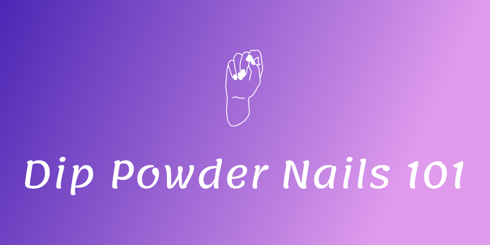

#Dip Powder Nails 101
Lindsay King

##000Webhost Link
[Dip Powder Nails 101](https://dippowdernails101.000webhostapp.com/)

##Timeline
- 9/6:
	- Approved Topic Proposal
- 9/25:
	- Repository Created
- 10/5:
	- SPMP Created
- 10/11:
	- Design Review and Tool Selection Meeting
- 10/15:
	- HTML pages started
- 11/18:
	- Website is live on 000webhost
- 11/20:
	- All Deliverables were submitted
- 11/24:
	- CSS implemented
- 11/28:
	- HTML and CSS finishing touches
- 11/29:
	- Presentation and website link submitted
- 12/7:
	- Project Presentation in class

##Resource Links Used
- [HTML](https://www.w3schools.com/html/default.asp)
- [CSS](https://www.w3schools.com/css/default.asp)
- [PHP](https://www.w3schools.com/php/default.asp)
- [Pinterest Save Button](
https://developers.pinterest.com/docs/widgets/save/?
)

##Problems with Project
- 000WebHost does not link to GitHub without paying for it
- Struggled with User Login and Registration
- No store/shopping cart aspect